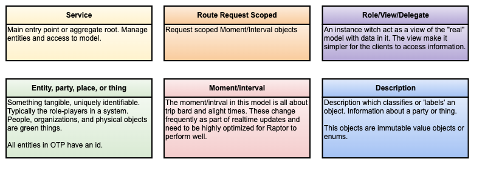

# Transit Model

DRAFT! THIS DOCUMENTATION IS NOT COMPLETE AND MIGHT BE OUT OF DATE COMPARED WITH THE CODE, AND 
VICE VERSA. 

 - The draft design will help us implement the new transit model, but it is too much work to keep 
   it "up to date". The audience is the developers actively working on refactoring the model.
 - We will use this doc as an "analyses and design" workbook. 
 - We will go over and make a "none draft" when it is time for review.


(THIS IS WORK IN PROGRESS! The packages are probably almost ok, but the dependencies are not...)


## Notation

UML Diagrams are used to illustrate the model. Colors are used to emphasise relationships, 
similarities or just visual grouping. For class diagrams we use a modified version of 
[Object Modeling in Color](https://en.wikipedia.org/wiki/Object_Modeling_in_Color).



The colors indicate:

- Importance - For example green is more important than Blue.
- Complexity  - Red and Orange are usually more complex than blue and green. This can help focus on the difficult parts(design, test, document, change management) .
- Outside role(Purple). Play a role outside the model, for example in Raptor. Exist only to serve an outside party.
- Lifecycle
   - Blue(descriptions) - live forever
   - Green(entities…) - live for a long time, but may change over time
   - Read(Moment/Interval/Event) Live until the next realtime update…
   - Orange - live in the scope of a request - a very short time
- Dependencies - Long lived types should not reference short-lived types:
   - Yellow → Orange → Red → Green → Blue
   - Not relevant for Purple


## Components

This is the top level package structure

 - [framework](framework/package.md) - framework to support the transit model 
 - basic - Value objects used across multiple packages.  
 - organization
 - site - StopLocation, RegularStop and Station +++ 
 - organization - Authority, Operator and booking info
 - network - Route
 - trip - Trip and TripOnDate
 - transfers - Regular and constrained transfer information
 - calendar - Operating days and patterns on day
 - timetable - Trip times for one operating day and trip schedule search
 - trip schedule??? To avoid circular dependencies we might need to join trip and timetable
 - plan - Support trip planning by implementing Raptor SPI. This is the main entry point. 

## Plan query
The plan query is number ONE reason why OTP exist, and the primary design goal of the transit model
is to support the plan query to be as efficient "as possible".


TODO RTM - Add an object diagram witch show the main types involved in a Raptor trip plan query.


## Services and its context

The `TransitService` is the main entry point for accessing all transit model objects. It may have 
nested services or provide read-only access to key model classes. For changing the model a 
`TransitEditorService` is created(obtained from the service). The editor can then be used to get a
builder for all _aggregate roots_[1]. For simplicity, we only allow _one_ editor to be active at 
any given time. 

[TODO RTM, clarify] Modifying, adding and deleting entities are **not** synchronized, so if more 
than one thread are doing updates at concurrent, then the synchronization responsibility is put on 
the client (graph builders and RealTimeSnapshot). When all modification are complete, then changes 
are made active by calling the `commit()` on the context. Before the `commit()` the changes are not 
visible by e.g. the routing. [TODO Diagram]


## Support for real-time updates

### RT-Notes
 - The real time information will be part of the TransitModel, not a separate Snapshot. So a trip
   will have both scheduled and realtime data. The RealTime updaters will copy parts of the model,
   change it and post it back tho the service, which apply the changes in a thread-safe way.
 - The data needed by for the routing will be put in a data structure optimized for routing. The 
   entities will not hold this data as fields, but be views of the data in the optimized model. 
   Fields/attributes not needed for trip routing will be part of the TransitModel objects.

### Design
This is a very early suggestion on how we want this to look - it is not based on a realistic 
use-case. The next step is to describe a couple RT updater use-cases - do a design for these and
test the design.

```Java
TransitModelEditor ctx = transitService().editTransitModel();

// To modify a trip we get the builder, change it, and call save() 
ctx.trip(id).withPrivateCode("CBP").save();

// A more common case would be to perform a change to a trip schedule on a given date
// We would like something like this. Here a combination of command and entity builders are used        
ctx.on(date).changePattern(patternMatcher).removeStop(stopId).save();
ctx.on(date).cancelTrip(tripMatcher).save();
ctx.on(date).updateTrip(matchId(tripId)).arrivalTime(stopId, arrTime).depatureTime(stopId, depTime).save();

// Revert an earlier update by going back to the planed version and apply new changes
// - for a given trip on date  
ctx.on(date).trip(id).revertToPlanned().withDelay(5m).save();
// - for all data for an agency
ctx.on(date).agency(id).revertToPlanned().trip(id).withDelay(5m).save();

// To update the model and make the changes visible to other threads
ctx.commit();
```